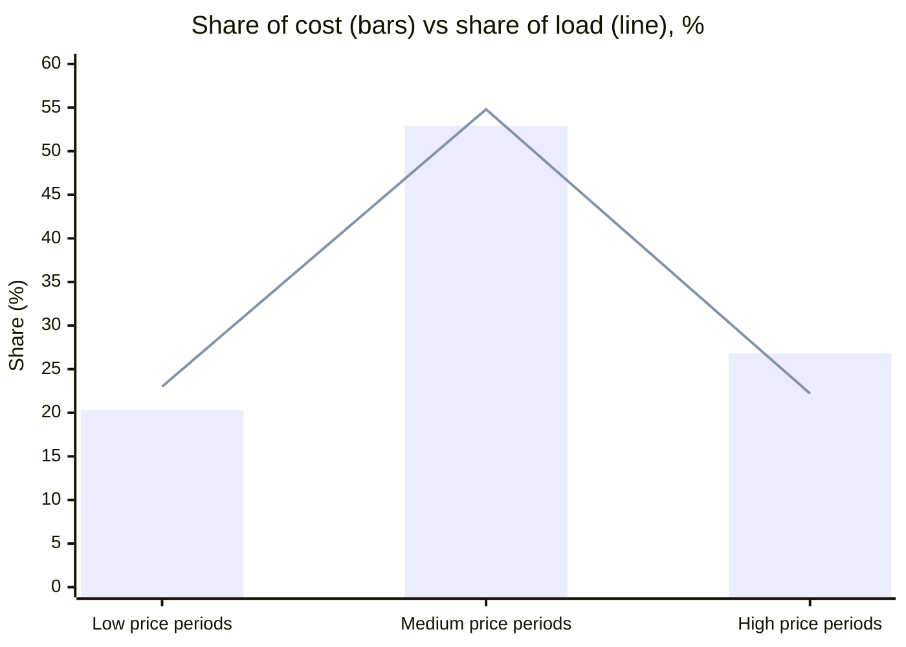

# Electricity Price Exposure Modelling

**What does a factory actually pay for wholesale electricity across a day, and is a simple average price a good enough estimate?**

This project combines half-hourly GB wholesale prices from Elexon with a factory load profile for **20 June 2026**. It calculates the factory's true cost exposure across all 48 settlement periods and compares it with the simple average price that is often used as a shortcut.

## Key results

| Metric | Value |
|---|---|
| Settlement periods modelled | 48 (full day, no gaps) |
| Total factory load | 73,400 kWh |
| Total weighted cost exposure | **£7,994** |
| Simple average market price | 10.98 p/kWh |
| Load-weighted exposure price | **10.89 p/kWh** (0.8% lower) |
| Price range across the day | 9.23 to 14.87 p/kWh |

**What this means**

- **Load-weighted cost was slightly lower** than the simple average, because the factory's baseload runs overnight when power is cheapest.
- **The evening peak costs more than its share of usage.** High-price periods (the top 25% of prices, mostly 19:00–22:00) account for **22% of the load but 27% of the cost**.
- **The morning production peak costs the most per slot.** Its highest-exposure half-hours (09:00–11:00, 2,200 kWh each) cost about £250–£268 per period, because that's when load peaks, and prices are above average (though below the evening peak).
- **What to act on:** moving flexible load out of the 19:00–22:00 window would cut costs the most per kWh moved.



*High-price periods carry 22% of the load but 27% of the cost. Full charts (load vs price, exposure by period, price-band shares) are in the notebook.*

## Approach

1. **Ingest.** Load the factory load profile and the Elexon BMRS market index data (provider `APXMIDP`) for the target date and the previous day.
2. **Check quality.** Look for missing values, confirm the schema, and make sure there are exactly 48 unique settlement periods with no duplicates. Negative or non-numeric loads raise an error.
3. **Standardise.** Harmonise column names and convert £/MWh to p/kWh.
4. **Model.** Merge load and price by settlement period. For each period, `exposure = kWh × p/kWh`, and the day total is divided by total kWh to give the load-weighted price.
5. **Segment.** Classify each period as a low (≤ 25th percentile), medium or high (≥ 75th percentile) price band, then compare each band's share of load with its share of cost.
6. **Output.** Export the period-level model, a summary, and the band summary as CSVs.

## Data

| Source | Description |
|---|---|
| Elexon BMRS market index (`APXMIDP`) | Half-hourly GB wholesale price (£/MWh) and volume for 19 and 20 June 2026 |
| Factory load profile | A proxy load shape with an overnight baseload and a daytime production peak, in kWh per settlement period |

## Assumptions and limitations

- The factory load is a **proxy profile**, not metered data. The method stays the same when real half-hourly meter data is used instead.
- The model uses a **single day**. Exposure changes with season, weekday and price volatility, so the next step is to run it across a month or a year.
- It covers **wholesale energy cost only**. Network charges, levies and supplier margins are excluded.
- The 19 June prices were loaded for comparison but aren't used in the final model.

## Next steps

- Run the model across many days to measure how exposure varies.
- Simulate load shifting, for example moving part of the evening load to overnight, and estimate the savings.
- Automate the price download with the Elexon Insights API instead of CSV exports.

## Tech stack

Python · pandas · NumPy · Matplotlib · Google Colab

## Run it

```bash
pip install pandas numpy matplotlib
```

Put the three input CSVs (`proxy_factory_load_2026-06-20.csv`, `elexon_market_index_2026-06-20.csv` and `elexon_market_index_2026-06-19.csv`) in a `data/` folder. Set `DRIVE_FOLDER` in the notebook to that folder, then run `Project_NWU.ipynb` from top to bottom.

---
**Author:** Harish Shanmughan, MSc Data Science · [GitHub](https://github.com/Hais002)
